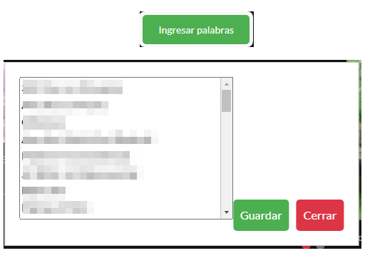

# Resaltar Texto Coincidente

**Última Actualización:** 06 de Febrero de 2024

Un script de Tampermonkey que permite resaltar palabras específicas en rojo en el sitio web [hentaitk.net](https://hentaitk.net). Los usuarios pueden gestionar las palabras a resaltar a través de un cuadro de texto interactivo, que guarda las palabras ingresadas para futuras visitas.

## Características

- Resalta palabras específicas en el contenido de la página.
- Administra las palabras a resaltar mediante un botón flotante que muestra un cuadro de texto.
- Las palabras se ingresan una por línea.
- Guarda automáticamente las palabras en `localStorage` para persistencia.
- Excluye etiquetas `<script>` y `<style>` para evitar conflictos.

## 🚀 Instalación

1. Instala la extensión **[Tampermonkey](https://www.tampermonkey.net/)** en tu navegador (compatible con Chrome, Firefox, Edge, y otros).
2. Abre Tampermonkey y selecciona la opción **"Crear un nuevo script"**.
3. Copia y pega el contenido del archivo [`script.js`](https://github.com/wernser412/Resaltar-texto-coincidente/raw/refs/heads/main/Resaltar%20texto%20coincidente.user.js) en el editor de Tampermonkey.
4. Guarda el script y asegúrate de que esté habilitado.
5. Ve a [hentaitk.net](https://hentaitk.net) y haz clic en el botón "Ingresar palabras" para comenzar.

## 🛠️ Configuración

1. Haz clic en el **ícono de Tampermonkey** en tu navegador.
2. Selecciona **"Configurar palabras resaltadas"**.
3. Ingresa las palabras que deseas resaltar, una por línea.
4. Guarda los cambios y recarga la página para aplicar los resaltados.

## 🎨 ¿Cómo Funciona?

- Resalta las palabras coincidentes en **rojo y negrita**.
- Guarda las palabras resaltadas en `localStorage` para que se mantengan entre sesiones.
- Usa `MutationObserver` para detectar cambios dinámicos en la página.

## 📜 Licencia

Este script está disponible bajo la **Licencia MIT**. ¡Úsalo y modifícalo libremente!

